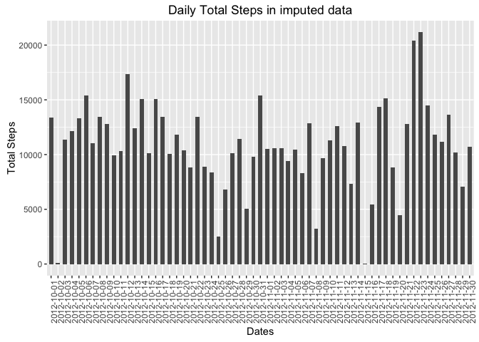
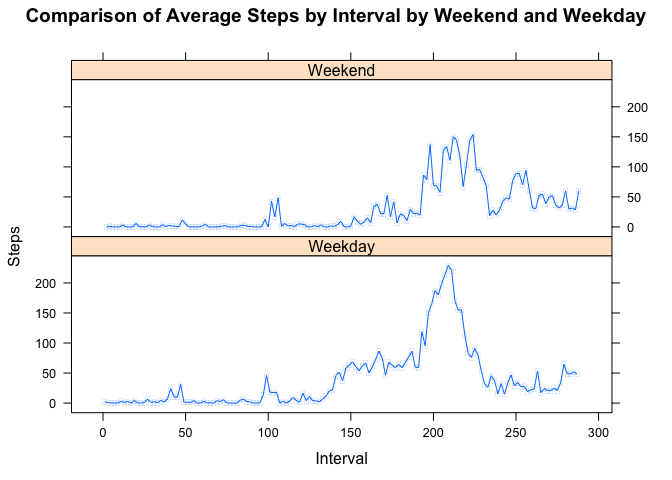

# Reproducible Research: Peer Assessment 1


```r
require("stringr")
```

```
## Loading required package: stringr
```

```r
require("knitr")
```

```
## Loading required package: knitr
```

```r
require("ggplot2")
```

```
## Loading required package: ggplot2
```


## Loading and preprocessing the data

Loading data from the file into a data frame, stopping the script
if data frame could not be created.


```r
##
##  Loads into a dataframe from a CSV file.
##    If specified by 'unzip', the function assumes 'localFile' is a 
##    zip archive and extracts its contents into 'unzipDestDir' or the 
##    current working directory if 'unzipDestDir' is empty or NULL.
##    This function assumes that the zip file contains a single CSV file.
##
readLocalCSVFile <- function(localFile, unzip = FALSE, unzipDestDir = NULL) {

      if( !file.exists(localFile)) {
            stop(paste0("File \'", 
                        localFile, 
                        "\'. Check permissions and access privileges if the file actually exists."));
      }
      
      retVal = localFile;
      if (unzip) { 
            if (is.null(unzipDestDir) || nchar(unzipDestDir) == 0) {
                  unzipDestDir <- getwd();  
            }
            
            unzipDestDir <- str_trim(unzipDestDir);
            
            if (!file.exists(unzipDestDir) 
               && !file.create(unzipDestDir)) {
                  stop(paste0("Unable to create unzip destination directory \'", 
                              unzipDestDir, "\'"));
            }
            
            retVal = unzip(localFile, exdir = unzipDestDir);
      }  
      
      if (!is.null(retVal)) {
            retVal <- read.csv(retVal, header = TRUE, colClasses = c(steps="integer", date="character", interval="integer"), stringsAsFactors = TRUE)
      }
      
      retVal
} ## readLocalCSVFile(..)

## Load the into 'dataset'
try(dataset <- readLocalCSVFile("activity.zip", unzip = TRUE), silent = TRUE)

dataset$date <- factor(dataset$date)
```

## What is mean total number of steps taken per day?


Mean of total number of daily steps: 9354.23

Median of total number of daily steps: 10395

##Total number of steps taken each day 
<!-- -->

## What is the average daily activity pattern?
<!-- -->


Interval # 835, viz. 13:55 hours, has the highest average steps taken among the intervals measured, with an average of 206.17 steps.

## Imputing missing values
Check the missing data pattern. The 1/0 flags indicate if the columns have complete or missing values.

```
## Loading required package: mice
```

```
## Loading required package: Rcpp
```

```
## mice 2.25 2015-11-09
```

```
##       date interval steps   V4
## 15264    1        1     1    0
##  2304    1        1     0    1
##          0        0  2304 2304
```
This shows that only the steps column has missing values. Imputing the data set using mice() with default values, except setting printFlag to FALSE.


<!-- -->

Mean of total number of daily steps in imputed data: 10852.082

Median of total number of daily steps in imputed data: 10765

The median has not changed, while the mean has increased reflecting the imputing of non-zero values for days which had no values in the original data set.

## Are there differences in activity patterns between weekdays and weekends?

```r
require("timeDate")
```

```
## Loading required package: timeDate
```

```r
impCompleted$isWeekend <- ifelse(!isWeekday(timeDate(impCompleted$date)), "Weekend", "Weekday")

require("lattice")
```

```
## Loading required package: lattice
```

```r
require("latticeExtra")
```

```
## Loading required package: latticeExtra
```

```
## Loading required package: RColorBrewer
```

```
## 
## Attaching package: 'latticeExtra'
```

```
## The following object is masked from 'package:ggplot2':
## 
##     layer
```

```r
factIntvlData <- split(impCompleted, impCompleted$interval)
df_AvgIntvlSteps <- data.frame(interval = integer(2 * length(factIntvlData)), steps = integer(2 * length(factIntvlData)), isWeekend = character(2 * length(factIntvlData)), stringsAsFactors = FALSE)

iter <- 0
for (intvl in factIntvlData) {
      ## get weekdays average
      avgIntvl <- mean(intvl$steps[intvl$isWeekend == 'Weekday'])
      iter <- iter + 1
      df_AvgIntvlSteps$interval[iter] <- as.numeric(intvl$interval[1])
      df_AvgIntvlSteps$steps[iter] <- as.numeric(avgIntvl)
      df_AvgIntvlSteps$isWeekend[iter] <- as.character('Weekday')

      ## weekend average
      avgIntvl <- mean(intvl$steps[intvl$isWeekend == 'Weekend'])
      iter <- iter + 1
      df_AvgIntvlSteps$interval[iter] <- as.numeric(intvl$interval[1])
      df_AvgIntvlSteps$steps[iter] <- as.numeric(avgIntvl)
      df_AvgIntvlSteps$isWeekend[iter] <- as.character('Weekend')
}

xyplot(df_AvgIntvlSteps$steps ~ seq(1, length(df_AvgIntvlSteps$interval) / 2) | df_AvgIntvlSteps$isWeekend, type = 'b', layout = c(1, 2), xlab = "Interval", ylab = "Steps", main = "Comparison of Average Steps by Interval by Weekend and Weekday", pch = -1)
```

<!-- -->

These plots of steps taken across intervals seem to indicate that the user reaches peak activity around 4 pm, both on weekdays and weekends, and is somewhat more active on weekend evenings than on weekday evenings.
