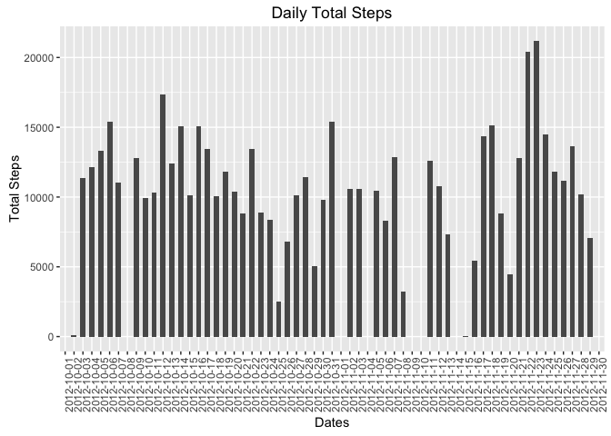
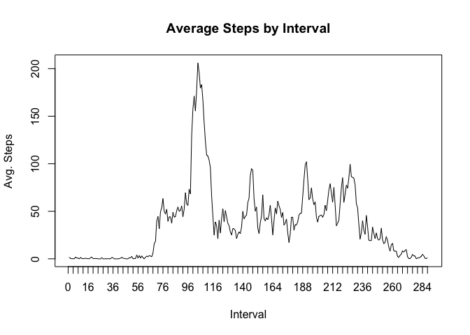

# Reproducible Research: Peer Assessment 1


```r
require("stringr")
```

```
## Loading required package: stringr
```

```r
require("knitr")
```

```
## Loading required package: knitr
```

```r
require("ggplot2")
```

```
## Loading required package: ggplot2
```


## Loading and preprocessing the data

Loading data from the file into a data frame, stopping the script
if data frame could not be created.


```r
##
##  Loads into a dataframe from a CSV file.
##    If specified by 'unzip', the function assumes 'localFile' is a 
##    zip archive and extracts its contents into 'unzipDestDir' or the 
##    current working directory if 'unzipDestDir' is empty or NULL.
##    This function assumes that the zip file contains a single CSV file.
##
readLocalCSVFile <- function(localFile, unzip = FALSE, unzipDestDir = NULL) {

      if( !file.exists(localFile)) {
            stop(paste0("File \'", 
                        localFile, 
                        "\'. Check permissions and access privileges if the file actually exists."));
      }
      
      retVal = localFile;
      if (unzip) { 
            if (is.null(unzipDestDir) || nchar(unzipDestDir) == 0) {
                  unzipDestDir <- getwd();  
            }
            
            unzipDestDir <- str_trim(unzipDestDir);
            
            if (!file.exists(unzipDestDir) 
               && !file.create(unzipDestDir)) {
                  stop(paste0("Unable to create unzip destination directory \'", 
                              unzipDestDir, "\'"));
            }
            
            retVal = unzip(localFile, exdir = unzipDestDir);
      }  
      
      if (!is.null(retVal)) {
            retVal <- read.csv(retVal, header = TRUE, colClasses = c(steps="integer", date="character", interval="integer"), stringsAsFactors = TRUE)
      }
      
      retVal
} ## readLocalCSVFile(..)

## Load the into 'dataset'
try(dataset <- readLocalCSVFile("activity.zip", unzip = TRUE), silent = TRUE)

dataset$date <- factor(dataset$date)
```

## What is mean total number of steps taken per day?


Mean of total number of daily steps: 9354.23

Median of total number of daily steps: 1.0395\times 10^{4}

##Total number of steps taken each day 
<!-- -->

## What is the average daily activity pattern?
<!-- -->


Interval # 835, viz. 13:55 hours, has the highest average steps taken among the intervals measured, with an average of 206.17 steps.

## Imputing missing values


## Are there differences in activity patterns between weekdays and weekends?
